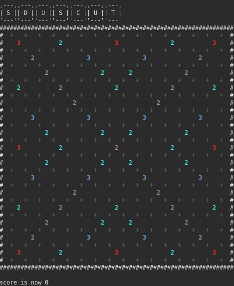

# Scrabble APC

Un joueur automatique de Scrabble utilisant la structure de données GADDAG pour déterminer le coup optimal sur un plateau de jeu.



## 📋 Table des matières

- [Description](#description)
- [Fonctionnalités](#fonctionnalités)
- [Structure du projet](#structure-du-projet)
- [Prérequis](#prérequis)
- [Installation](#installation)
- [Compilation](#compilation)
- [Utilisation](#utilisation)
- [Architecture](#architecture)
- [Algorithme GADDAG](#algorithme-gaddag)
- [Tests](#tests)
- [Contributeurs](#contributeurs)

## 🎯 Description

Ce projet implémente un joueur automatique de Scrabble capable de :
- Analyser un plateau de jeu
- Gérer les lettres disponibles et le sac de pioche
- Utiliser une structure GADDAG pour rechercher efficacement les mots valides
- Calculer le score optimal en tenant compte des bonus
- Proposer le meilleur coup possible

## ✨ Fonctionnalités

- **Gestion complète du jeu** : plateau, lettres, sac de pioche, joueurs
- **Structure GADDAG** : recherche efficace de mots dans le dictionnaire
- **Calcul de score** : prise en compte des multiplicateurs de lettres et de mots
- **Interface graphique** : visualisation du plateau avec SFML (optionnel)
- **Dictionnaire français** : liste complète des mots autorisés au Scrabble

## 📁 Structure du projet

```
apcscrabble/
├── bin/                    # Exécutables compilés
├── obj/                    # Fichiers objets (.o)
│   ├── elements/
│   └── gui/
├── data/                   # Données du projet
│   ├── dico.txt           # Dictionnaire de mots français
│   └── exemple_arbre.tex  # Documentation de la structure
├── src/                    # Code source
│   ├── elements/          # Classes principales
│   │   ├── bag.cpp/hpp        # Sac de lettres
│   │   ├── board.cpp/hpp      # Plateau de jeu
│   │   ├── bonus.cpp/hpp      # Gestion des bonus
│   │   ├── letter.cpp/hpp     # Représentation des lettres
│   │   ├── player.cpp/hpp     # Gestion des joueurs
│   │   ├── spot.cpp/hpp       # Cases du plateau
│   │   ├── Gaddag.cpp/hpp     # Structure GADDAG
│   │   └── NoeudGaddag.cpp/hpp # Nœuds de l'arbre GADDAG
│   ├── gui/               # Interface graphique (SFML)
│   │   ├── board_gui.cpp/hpp
│   │   ├── gui.cpp/hpp
│   │   ├── main_gui.cpp
│   │   └── README_SFML.md
│   ├── test_board.cpp     # Tests du plateau
│   └── Makefile           # Fichier de compilation
├── CMakeLists.txt         # Configuration CMake
├── consigne.md            # Consignes du projet
└── README.md              # Ce fichier
```

## 🔧 Prérequis

### Compilation de base
- **Compilateur C++** : g++ avec support C++11 ou supérieur
- **Make** : pour utiliser le Makefile
- **CMake** : version 3.12 ou supérieure (optionnel)

### Interface graphique (optionnel)
- **SFML** : bibliothèque pour l'interface graphique

Installation de SFML sur Linux :
```bash
sudo apt update
sudo apt install libsfml-dev
```

## 🚀 Installation

1. **Cloner le dépôt**
```bash
git clone https://github.com/emmamrgn/scrabble-apc.git
cd scrabble-apc
```

2. **Créer les répertoires nécessaires** (si non existants)
```bash
mkdir -p bin obj/elements obj/gui
```

## 🔨 Compilation

### Méthode 1 : Avec Make (recommandé)

```bash
cd src
make test_board
```

L'exécutable sera généré dans `../bin/test_board`

### Méthode 2 : Avec CMake

```bash
mkdir build
cd build
cmake ..
make
```

### Compilation de l'interface graphique

```bash
cd src/gui
make
```

L'exécutable sera dans `../../bin/scrabble-app`

## 🎮 Utilisation

### Exécuter les tests

```bash
./bin/test_board
```

### Lancer l'interface graphique

```bash
./bin/scrabble-app
```

### Utiliser le serveur de test

Pour tester votre algorithme, vous pouvez utiliser le serveur de test en ligne :

```
https://liris.cnrs.fr/vincent.nivoliers/scrabble.php?board=<plateau>&rack=<lettres>
```

Remplacez :
- `<plateau>` : le plateau au format produit par la méthode `save` de la classe `Board`
- `<lettres>` : les lettres disponibles pour jouer

Exemple : pour les lettres `AQEIESZ` sur un plateau donné, le serveur retournera le meilleur coup possible avec son score.

## 🏗️ Architecture

### Classes principales

#### `Letter` - Gestion des lettres
Représente une lettre du Scrabble avec sa valeur en points.

#### `Bag` - Sac de lettres
Gère le sac contenant toutes les lettres disponibles :
- 102 lettres au total
- Pioche aléatoire en temps constant
- Distribution selon les règles du Scrabble français

| Lettre | Nombre | Points | Lettre | Nombre | Points |
|--------|--------|--------|--------|--------|--------|
| A | 9 | 1 | N | 6 | 1 |
| B | 2 | 3 | O | 6 | 1 |
| C | 2 | 3 | P | 2 | 3 |
| D | 3 | 2 | Q | 1 | 8 |
| E | 15 | 1 | R | 6 | 1 |
| F | 2 | 4 | S | 6 | 1 |
| G | 2 | 2 | T | 6 | 1 |
| H | 2 | 4 | U | 6 | 1 |
| I | 8 | 1 | V | 2 | 4 |
| J | 1 | 8 | W | 1 | 10 |
| K | 1 | 10 | X | 1 | 10 |
| L | 5 | 1 | Y | 1 | 10 |
| M | 3 | 2 | Z | 1 | 10 |

#### `Player` - Joueur
Représente un joueur avec ses 7 lettres disponibles.

#### `Board` - Plateau de jeu
Gère le plateau 15×15 avec :
- Placement et retrait de lettres
- Chargement/sauvegarde depuis un fichier
- Gestion des cases spéciales (bonus)

#### `Spot` - Case du plateau
Représente une case individuelle avec :
- La lettre présente (ou vide)
- Le type de bonus (lettre double/triple, mot double/triple)

#### `Bonus` - Types de bonus
Énumération des différents bonus du plateau.

#### `Gaddag` - Structure de recherche
Arbre de recherche optimisé pour trouver les mots valides :
- Construction depuis le dictionnaire
- Recherche de mots par le milieu
- Support de la lettre spéciale `+` pour la recherche bidirectionnelle

#### `NoeudGaddag` - Nœud de l'arbre
Représente un nœud dans la structure GADDAG.

## 🔍 Algorithme GADDAG

### Principe

Le GADDAG est une structure de données optimisée pour le Scrabble qui permet de rechercher des mots **en partant du milieu**. Cette caractéristique est cruciale car au Scrabble, on doit placer des lettres autour des lettres déjà présentes sur le plateau.

### Fonctionnement

Pour chaque mot du dictionnaire (exemple : `BATEAU`), on crée plusieurs variantes avec le symbole `+` :

```
B+ATEAU
AB+TEAU
TAB+EAU
ETAB+AU
AETAB+U
UAETAB+
```

Avant le `+` : lettres inversées  
Après le `+` : lettres dans l'ordre normal

### Recherche

Lorsqu'on cherche un mot à placer à partir d'une lettre existante sur le plateau :
1. On part de cette lettre
2. On explore l'arbre GADDAG
3. Le `+` indique le moment où on change de direction (gauche → droite ou haut → bas)
4. On vérifie que toutes les lettres perpendiculaires forment aussi des mots valides

### Cas de départ

Tout nouveau mot doit passer par **une case vide adjacente à une case occupée**. L'algorithme initialise donc ses recherches sur ces cases.

## 🧪 Tests

Le projet inclut un fichier de test `test_board.cpp` qui permet de vérifier :
- Le chargement du plateau
- Le placement de lettres
- La sauvegarde du plateau

Pour exécuter les tests :
```bash
./bin/test_board
```

## 👥 Contributeurs

Projet réalisé dans le cadre du cours d'Algorithmique et Programmation C++ (APC).

---

## 📚 Ressources

- [Règles du Scrabble](https://www.scrabble.com/rules)
- [Article Wikipedia sur GADDAG](https://en.wikipedia.org/wiki/GADDAG)
- [Documentation SFML](https://www.sfml-dev.org/documentation/)

## 📝 Licence

Ce projet est un projet éducatif réalisé à l'université.
